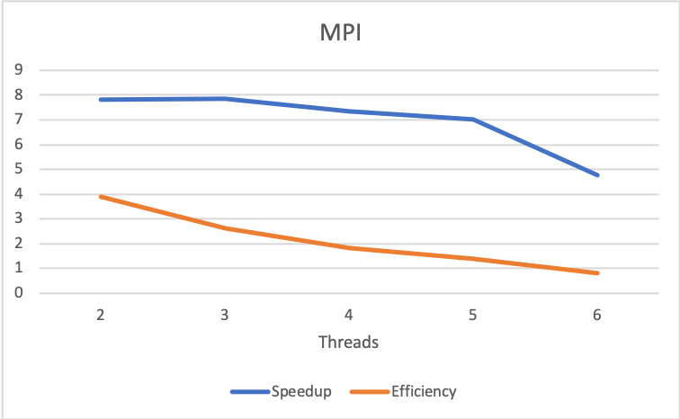

# PROJECT 2 – HPC

## Team Members:

* Alex Montoya Franco - amonto69@eafit.edu.co

* Ronald Cardona Martínez - rcardo11@eafit.edu.co

* Camila White Romero - cwhiter@eafit.edu.co


##  OPTION 2 – TEXT MINING

### Multi-thread Design with OpenMP
* [OpenMP](openmp.md)

### PCAM Methodology
* [PCAM](pcam.md)


### Steps

A preprocessing of the data is done with python, where a new file is created with the columns:

| ID            | Title         | Content  |
| ------------- |:-------------:| --------:|
|               |               |          |
|               |               |          |

In addition, stopwords and punctuation are eliminated.

The serial C ++ code was made, composed of:

* A *batch* step where the word count is made with every word in each file and save it in a map
 
* An *online* step where the user enter a word and it is searched in the map created in the *batch* step.
Results are printed.

The parallel algorithms were made using OpenMP (OpenMP folder) and MPI (MPI folder).

### Pre-processing

[Pre-processing](serial/etl.py)

Before beginning with the implementation of the serial algorithm it was decided to make a data cleaning process, for ease, making use of the Python programming language. In this pre-processing stage, the following is modified to the dataset:

* Columns that were not used were removed, leaving only (ID, Title, Content).
* All stopwords and punctuation marks were removed from the content field of all the news in the dataset.
* A new file was written with the data clean and separated by tabulator (\ t), since the fields of *content* per have commas (,), making it impossible to read the data correctly.

| File          | Without clean | Clean    |
| ------------- |:-------------:| --------:|
| Articles1.csv | 130           | 195      |
| Articles2.csv | 140           | 216      |
| Articles3.csv | 151           | 230      |
* This table shows the weights in Megabytes of the files before and after this first stage.

To run this file, follow the next steps.
* Python3 must be installed.
* Must have acces to the dataset (articles#.csv)
* Install nltk (Natural Language Toolkit) and Pandas for Python3.
```
$ pip3 install pandas nltk
```
* Run the file.
```
$ /opt/anaconda3/bin/python3 etl.py
```

If you want to use the files already pre-processed, just run:
```
$ cd datasets
$ unzip '*.zip'
```

### Serial Algorithm

[Serial Algorithm](serial/serial.cpp)

For the implementation of the serial algorithm we followed the suggested strategy of putting together an inverted index with all the news in which each word appears. This part of the processing is developed in batch and it is where the majority of resources and processing time are spent.

To run this file, just follow the next steps:
* Compile.
```
$ g++ serial.cpp -o serial -std=c++11
```
* Run the executable.
```
$ ./serial
```

### OpenMP Algorithm

[OpenMP Algorithm](openmp/openmp.py)

For the implementation of the parallel algorithm with OpenMP, we used the serial algorithm as base and then started to parallelize de code. 
We used #pragma omp parallel to create the threads and #pragma omp critical to prevent different threads accesing the same region at a time. A complete specification of openmp algorithm can be found [here](openmp.md)

To run this file, just follow the next steps:
* Compile.
```
$ g++ openmp.cpp -o openmp -std=c++11 -fopenmp
```
* Define the number of threads.
```
$ export OMP_NUM_THREADS=3
```
* Run the executable.
```
$ ./openmp
```

### MPI Algorithm

[OpenMP Algorithm](openmp/openmp.py)

For the implementation of the parallel algorithm with MPI, we used the OpenMP algorithm as base and then started to parallelize de code. 
We use three processes, each one open a file and processes it. 
For a better explanation, go to [PCAM](pcam.md).

To run this file, just follow the next steps:
* Compile.
```
$  mpic++ mpi.cpp -o mpi -std=c++11 -fopenmp
```
* Define the number of threads.
```
$ export OMP_NUM_THREADS=3
```
* Run the executable.
```
$ mpirun -f hosts -np 3 ./mpi
```

### Analysis of Results

#### Serial Version
It is evident that the serial algorithm is very slow due to the fact that 150000 lines must be read and must find each of the word frequencies, this last part is O(n), where n is the number of words in the content column of the data sets. In addition, the words are added to a std :: map where the order is logarithmic in the size of the container.

The serial algorithm took 227.649 seconds to create de inverted index. 

#### OpenMP Parallel Version

Decomposing the serial algorithm into smaller tasks is very clear here, we can process each line of the input in parallel but we encounter 2 barriers. 1. getting the line to process and 2.  adding word-frecuencies to the map (see [OpenMp](openmp.md)). This is why we needed to implement 2 critical regions and the speedup of the openmp algorithm is lower than expected.

The parallel version with OpenMP took the following times depending on the number of threads. 


With the images, it can be evidenced that with 3 threads the best time is obtained. Therefore, the higher the number of threads, the lower the openmp implementation gets.

We also concluded that only an implementation using OpenMP is not efficient, because of the cost in number of processors is high in terms of such small speedup.

#### OpenMP + MPI Parallel Version
Due to the features of the dataset and the design made based on [pcam.md](PCAM methodologhy) obvious way to use MPI was to distribute the work between 3 nodes, where each one will process one input file in the OpenMP way.
The speedup obtained is significant because each node process its file independently and no interprocess comunication is done, the local results are kept by the worker node and are totalized in the online phase.

The parallel version with OpenMP + MPI took the following times depending on the number of threads. 




