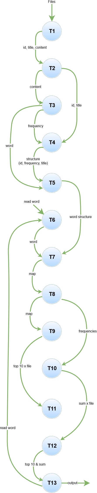

# Avance

Se realiza un preprocesamiento de los datos con python, en donde se crea un nuevo archivo con las columnas:

| ID            | Title         | Content  |
| ------------- |:-------------:| --------:|
|               |               |          |
|               |               |          |

Además, se eliminan las stopwords y signos de puntuación. 

Se realizó el código serial de C++, compuesto por:
* Una parte *batch* la cual consiste en un word count de todas las palabras de los archivos y las almacena en un mapa.
* Una parte *online* donde el usuario ingresa una palabra y se busca esta palabra en el mapa creado en la parte *batch* y se imprimen los resultados. 
* Se trabajó en el algoritmo paralelo usando OpenMP. (carpeta OpenMP)

Metodología PCAM

## Comunicación

## Aglomeración (replicación de procesos y datos)

- Repliciar datos: T6 --> palabra(3)
- Replicar procesos: T1, T2, T3, T4, T5, T7, T8, T9, T10

Agrupar tareas

- T8, 79
- T4, T5
- T1, T2

## Partición

T1 --> Cargar archivos preprocesados
T2 --> Obtener id, titulo, contenido
T3 --> Calcular frecuencia de cada palabra por content(noticia)
T4 --> Almacenar en una estructura, la frecuencia, id y titulo
T5 --> Almacenar en un mapa las palabras (key) y la estructura de todas las noticias (value)
T6 --> Leer palabra de consola
T7 --> Crear mapa con palabra (key) y estructura
T8 --> Ordenar el mapa de mayor frecuencia a menor
T9 --> Top 10 parcial (frecuencia de la palabra por archivo)
T10 --> Suma parcial (frecuencia de la palabra)
T11 --> Top 10 total (frecuencia de la palabra en el dataset)
T12 --> Suma total (frecuencia de la palabra)
T13 --> Imprimir top 10 y suma total
