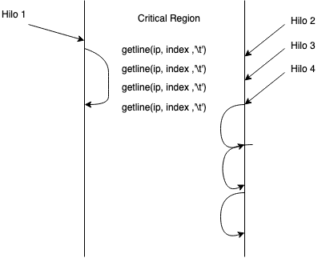

# OpenMP Algorithm
What the serial algorithm does is consume line by line the input file and then index every word and its frecuency in the current article.
To take advantage of multi processing on a single node we decided to parallelize the process of building up the inverted index by means of processing multiple input lines at a time. 
That is the basic idea of the parallel algorithm implemented using OpenMP. 

* To ensure the correctness of the data passed to each thread, a critical region is needed (figure above). From now on, each thread can do its own work no matter what the state of any other thread is. 
* The thread calculates the word-frequency mapping for the article it retrieved from the file.
* Then, when the thread is done, it enters another critical region to add the word-frequency pairs to the inverted index, this is done to prevent conflicts in the index, because many threads can be trying to access the same entries at a time.
* Then it leaves the last critical region and starts the loop again, if there are any lines left, the thread queues until it gets the turn to read the next one.
* This process can be done with many threads simultaneously. But the performance is reduced using more than 3 threads, because of the use of critical regions is heavy and the queues may be time-wasters.
