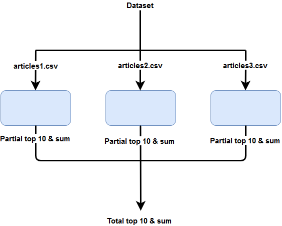
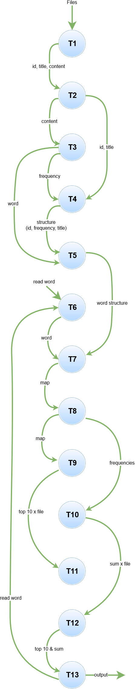
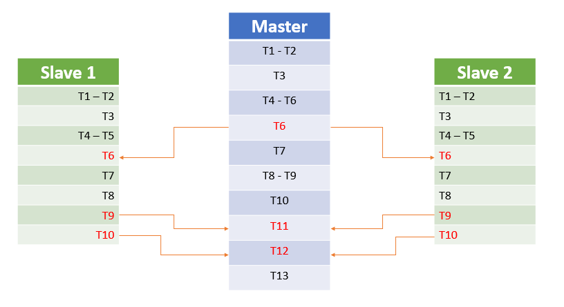

# PCAM Methodology

### How we adress the problem

## Partitioning

* T1. Load preprocessed files
* T2. Get id, title and content
* T3. Calculate the frequency of each word by content(news)
* T4. Save in a structure, the frequency, id and title
* T5. Save in a map the words (key) and the structure of all the news (value)
* T6. Read word by console
* T7. Create a map with word (key) and structure (value)
* T8. Sort the map from higher frequency to lower   
* T9. Partial top 10 (frequency of the word per file)
* T10. Partial Sum (frequency of the word per file)
* T11. Total top 10 (frequency of the word in the whole dataset)
* T12. Total sum (frequency of the word in the dataset)
* T13. Output the Top 10 and Sum

## Communication

## Agglomeration (Process and Data replication)

* Data replication: [T6] Replication the word read by console in order to receive a coppy of the word by every process.

* Process replication: [T1], [T2], [T3], [T4], [T5], [T7], [T8], [T9], [T10]

* Task's clusters: [T8, 79] - [T4, T5] - [T1, T2]

## Mapping

Synchronous: [T6] because send the word to the slaves and continues with the execution.

Asynchronous: [T9, T10] because the master is waiting for the partial top 10 and sum from the slaves to continue with the execution.